**前言**

> KASAN是一个动态检测内存错误的工具。KASAN可以检测全局变量、栈、堆分配的内存发生越界访问等问题。功能比SLUB DEBUG齐全并且支持实时检测。越界访问的严重性和危害性通过我之前的文章（SLUB DEBUG技术）应该有所了解。正是由于SLUB DEBUG缺陷，因此我们需要一种更加强大的检测工具。难道你不想吗？KASAN就是其中一种。KASAN的使用真的很简单。但是我是一个追求刨根问底的人。仅仅止步于使用的层面，我是不愿意的，只有更清楚的了解实现原理才能更加熟练的使用工具。不止是KASAN，其他方面我也是这么认为。但是，说实话，写这篇文章是有点底气不足的。因为从我查阅的资料来说，国内没有一篇文章说KASAN的工作原理，国外也是没有什么文章关注KASAN的原理。大家好像都在说How to use。由于本人水平有限，就根据现有的资料以及自己阅读代码揣摩其中的意思。本文章作为抛准引玉，如果有不合理的地方还请指正。  
> 注：文章代码分析基于linux-4.15.0-rc3。

## 简介

KernelAddressSANitizer（KASAN）是一个动态检测内存错误的工具。它为找到use-after-free和out-of-bounds问题提供了一个快速和全面的解决方案。KASAN使用编译时检测每个内存访问，因此您需要GCC 4.9.2或更高版本。检测堆栈或全局变量的越界访问需要GCC 5.0或更高版本。目前KASAN仅支持x86_64和arm64架构（linux 4.4版本合入）。你使用ARM64架构，那么就需要保证linux版本在4.4以上。当然了，如果你使用的linux也有可能打过KASAN的补丁。例如，使用高通平台做手机的厂商使用linux 3.18同样支持KASAN。

> **【文章福利**】小编推荐自己的Linux内核源码交流群:【**[869634926](https://link.zhihu.com/?target=https%3A//jq.qq.com/%3F_wv%3D1027%26k%3D9ihPowUX)**】整理了一些个人觉得比较好的学习书籍、视频资料共享在群文件里面，有需要的可以自行添加哦！！！前50名可进群领取！！！并额外赠送一份价值600的内核资料包（含视频教程、电子书、实战项目及代码)！！！


**学习直通车：**[Linux内核源码/内存调优/文件系统/进程管理/设备驱动/网络协议栈](https://link.zhihu.com/?target=https%3A//ke.qq.com/course/4032547%3FflowToken%3D1040236)

## 如何使用

使用KASAN工具是比较简单的，只需要添加kernel以下配置项。

CONFIG_SLUB_DEBUG=y

CONFIG_KASAN=y

为什么这里必须打开SLUB_DEBUG呢？是因为有段时间KASAN是依赖SLUBU_DEBUG的，什么意思呢？就是在Kconfig中使用了depends on，明白了吧。不过最新的代码已经不需要依赖了，可以看下提交。但是我建议你打开该选项，因为log可以输出更多有用的信息。重新编译kernel即可，编译之后你会发现boot.img（Android环境）大小大了一倍左右。所以说，影响效率不是没有道理的。不过我们可以作为产品发布前的最后检查，也可以排查越界访问等问题。我们可以查看内核日志内容是否包含KASAN检查出的bugs信息。

**往期回顾：**

[详谈静态库和动态库的区别](https://zhuanlan.zhihu.com/p/544022813)

[《嵌入式开发笔记》教你解决解决大厂面试难题](https://zhuanlan.zhihu.com/p/530606229)

[简单理解Linux的Memory Overcommit](https://zhuanlan.zhihu.com/p/551677956)

[【看完秒懂】ARM 软中断指令SWI](https://zhuanlan.zhihu.com/p/550570075)

[Linux内存管理——大部分人没有掌握的shmall和shmmax参数](https://zhuanlan.zhihu.com/p/551804053)

[全站最细节的Linux内存管理源码分析|内存映射的原理|虚拟内存区域|内存组织|内存屏障原理|内存调优_哔哩哔哩_bilibili​www.bilibili.com/video/BV1zS4y147J6/](https://link.zhihu.com/?target=https%3A//www.bilibili.com/video/BV1zS4y147J6/)

## KASAN是如何实现检测的？

KASAN的原理是利用额外的内存标记可用内存的状态。这部分额外的内存被称作shadow memory（影子区）。KASAN将1/8的内存用作shadow memory。使用特殊的magic num填充shadow memory，在每一次load/store（load/store检查指令由编译器插入）内存的时候检测对应的shadow memory确定操作是否valid。连续8 bytes内存（8 bytes align）使用1 byte shadow memory标记。如果8 bytes内存都可以访问，则shadow memory的值为0；如果连续N(1 =< N <= 7) bytes可以访问，则shadow memory的值为N；如果8 bytes内存访问都是invalid，则shadow memory的值为负数。

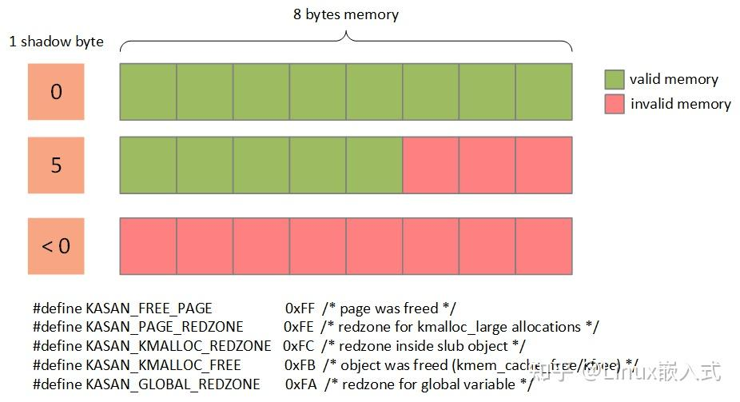

在代码运行时，每一次memory access都会检测对应的shawdow memory的值是否valid。这就需要编译器为我们做些工作。编译的时候，在每一次memory access前编译器会帮我们插入__asan_load##size()或者__asan_store##size()函数调用（size是访问内存字节的数量）。这也是要求更新版本gcc的原因，只有更新的版本才支持自动插入。

```cpp
mov x0, #0x5678
movk x0, #0x1234, lsl #16
movk x0, #0x8000, lsl #32
movk x0, #0xffff, lsl #48
mov w1, #0x5
bl __asan_store1
strb w1, [x0]
```

上面一段汇编指令是往0xffff800012345678地址写5。在KASAN打开的情况下，编译器会帮我们自动插入bl __asan_store1指令，__asan_store1函数就是检测一个地址对应的shadow memory的值是否允许写1 byte。蓝色汇编指令就是真正的内存访问。因此KASAN可以在out-of-bounds的时候及时检测。__asan_load##size()和__asan_store##size()的代码在mm/kasan/kasan.c文件实现。

### 如何根据shadow memory的值判断内存访问操作是否valid？

shadow memory检测原理的实现主要就是__asan_load##size()和__asan_store##size()函数的实现。那么KASAN是如何根据访问的address以及对应的shadow memory的状态值来判断访问是否合法呢？首先看一种最简单的情况。访问8 bytes内存。

```cpp
long *addr = (long *)0xffff800012345678;
*addr = 0;
```

以上代码是访问8 bytes情况，检测原理如下：

```cpp
long *addr = (long *)0xffff800012345678;
char *shadow = (char *)(((unsigned long)addr >> 3) + KASAN_SHADOW_OFFSE);
if (*shadow)
    report_bug();
*addr = 0;
```

红色区域类似是编译器插入的指令。既然是访问8 bytes，必须要保证对应的shadow mempry的值必须是0，否则肯定是有问题。那么如果访问的是1,2 or 4 bytes该如何检查呢？也很简单，我们只需要修改一下if判断条件即可。修改如下：  
if (*shadow && *shadow < ((unsigned long)addr & 7) + N); //N = 1,2,4  
如果*shadow的值为0代表8 bytes均可以访问，自然就不需要report bug。addr & 7是计算访问地址相对于8字节对齐地址的偏移。还是使用下图来说明关系吧。假设内存是从地址8~15一共8 bytes。对应的shadow memory值为5，现在访问11地址。那么这里的N只要大于2就是invalid。

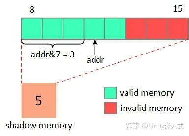

### shadow memory内存如何分配？

在ARM64中，假设VA_BITS配置成48。那么kernel space空间大小是256TB，因此shadow memory的内存需要32TB。我们需要在虚拟地址空间为KASAN shadow memory分配地址空间。所以我们有必要了解一下ARM64 memory layout。  
基于linux-4.15.0-rc3的代码分析，我绘制了如下memory layout（VA_BITS = 48）。kernel space起始虚拟地址是0xffff_0000_0000_0000，kernel space被分成几个部分分别是KASAN、MODULE、VMALLOC、FIXMAP、PCI_IO、VMEMMAP以及linear mapping。其中KASAN的大小是32TB，正好是kernel space大小的1/8。不知道你注意到没有，KERNEL的位置相对以前是不是有所不一样。你的印象中，KERNEL是不是位于linear mapping区域，这里怎么变成了VMALLOC区域？这里是Ard Biesheuvel提交的修改。主要是为了迎接ARM64世界的KASLR（which allows the kernel image to be located anywhere in the vmalloc area）的到来。

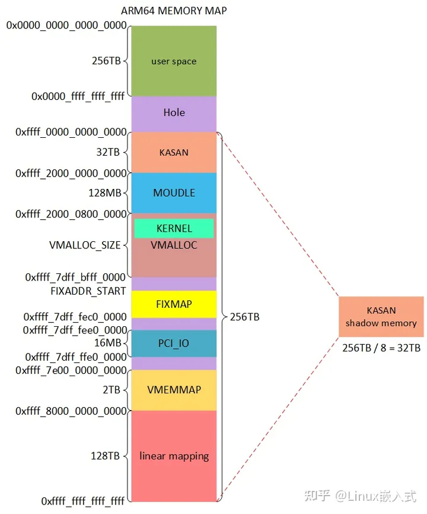

### 如何建立shadow memory的映射关系？

当打开KASAN的时候，KASAN区域位于kernel space首地址处，从0xffff_0000_0000_0000地址开始，大小是32TB。shadow memory和kernel address转换关系是：shadow_addr = (kaddr >> 3) + KASAN_SHADOW_OFFSE。为了将[0xffff_0000_0000_0000, 0xffff_ffff_ffff_ffff]和[0xffff_0000_0000_0000, 0xffff_1fff_ffff_ffff]对应起来，因此计算KASAN_SHADOW_OFFSE的值为0xdfff_2000_0000_0000。我们将KASAN区域放大，如下图所示。

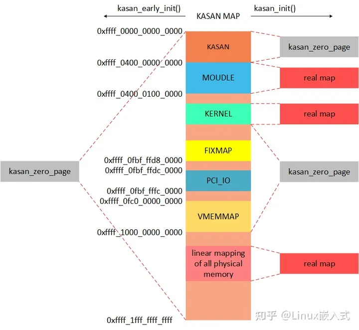

KASAN区域仅仅是分配的虚拟地址，在访问的时候必须建立和物理地址的映射才可以访问。上图就是KASAN建立的映射布局。左边是系统启动初期建立的映射。在kasan_early_init()函数中，将所有的KASAN区域映射到kasan_zero_page物理页面。因此系统启动初期，KASAN并不能工作。右侧是在kasan_init()函数中建立的映射关系，kasan_init()函数执行结束就预示着KASAN的正常工作。我们将不需要address sanitizer功能的区域同样还是映射到kasan_zero_page物理页面，并且是readonly。我们主要是检测kernel和物理内存是否存在UAF或者OOB问题。所以建立KERNEL和linear mapping（仅仅是所有的物理地址建立的映射区域）区域对应的shadow memory建立真实的映射关系。MOUDLE区域对应的shadow memory的映射关系也是需要创建的，但是映射关系建立是动态的，他在module加载的时候才会去创建映射关系。

### 伙伴系统分配的内存的shadow memory值如何填充？

既然shadow memory已经建立映射，接下来的事情就是探究各种内存分配器向shadow memory填充什么数据了。首先看一下伙伴系统allocate page(s)函数填充shadow memory情况。

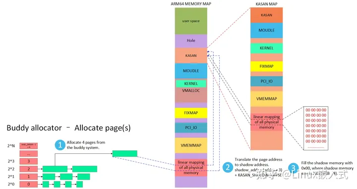

假设我们从buddy system分配4 pages。系统首先从order=2的链表中摘下一块内存，然后根据shadow memory address和memory address之间的对应的关系找对应的shadow memory。这里shadow memory的大小将会是2KB，系统会全部填充0代表内存可以访问。我们对分配的内存的任意地址内存进行访问的时候，首先都会找到对应的shadow memory，然后根据shadow memory value判断访问内存操作是否valid。

如果释放pages，情况又是如何呢？

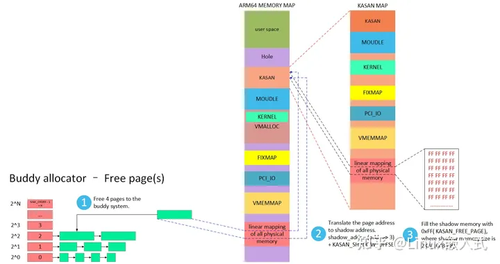

同样的，当释放pages的时候，会填充shadow memory的值为0xFF。如果释放之后，依然访问内存的话，此时KASAN根据shadow memory的值是0xFF就可以断，这是一个use-after-free问题。

### SLUB分配对象的内存的shadow memory值如何填充？

当我们打开KASAN的时候，SLUB Allocator管理的object layout将会放生一定的变化。如下图所示。

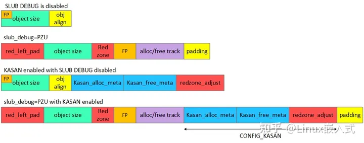

在打开SLUB_DEBUG的时候，object就增加很多内存，KASAN打开之后，在此基础上又加了一截。为什么这里必须打开SLUB_DEBUG呢？是因为有段时间KASAN是依赖SLUBU_DEBUG的，什么意思呢？就是在Kconfig中使用了depends on，明白了吧。不过最新的代码已经不需要依赖了，可以看下提交。

当我们第一次创建slab缓存池的时候，系统会调用kasan_poison_slab()函数初始化shadow memory为下图的模样。整个slab对应的shadow memory都填充0xFC。


上述步骤虽然填充了0xFC，但是接下来初始化object的时候，会改变一些shadow memory的值。我们先看一下kmalloc(20)的情况。我们知道kmalloc()就是基于SLUB Allocator实现的，所以会从kmalloc-32的kmem_cache中分配一个32 bytes object。

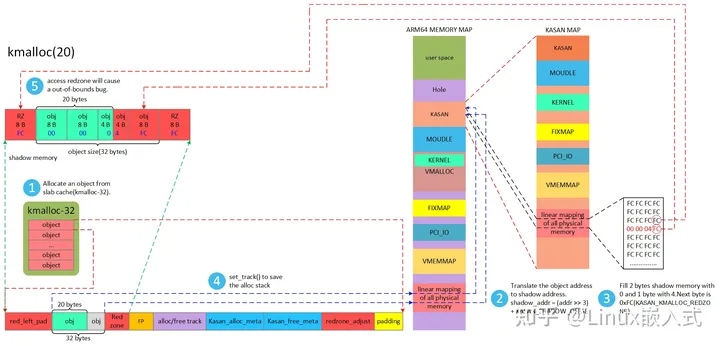

首先调用kmalloc(20)函数会匹配到kmalloc-32的kmem_cache，因此实际分配的object大小是32 bytes。KASAN同样会标记剩下的12 bytes的shadow memory为不可访问状态。根据object的地址，计算shadow memory的地址，并开始填充数值。由于kmalloc()返回的object的size是32 bytes，由于kmalloc(20)只申请了20 bytes，剩下的12 bytes不能使用。KASAN必须标记shadow memory这种情况。object对应的4 bytes shadow memory分别填充00 00 04 FC。00代表8个连续的字节可以访问。04代表前4个字节可以访问。作为越界访问的检测的方法。总共加在一起是正好是20 bytes可访问。0xFC是Redzone标记。如果访问了Redzone区域KASAN就会检测out-of-bounds的发生。

当申请使用之后，现在调用kfree()释放之后的shadow memory情况是怎样的呢？看下图。

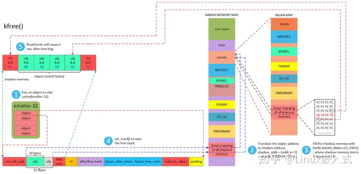

根据object首地址找到对应的shadow memory，32 bytes object对应4 bytes的shadow memory，现在填充0xFB标记内存是释放的状态。此时如果继续访问object，那么根据shadow memory的状态值既可以确定是use-after-free问题。

### 全局变量的shadow memory值如何填充？

前面的分析都是基于内存分配器的，Redzone都会随着内存分配器一起分配。那么global variables如何检测呢？global variable的Redzone在哪里呢？这就需要编译器下手了。编译器会帮我们填充Redzone区域。例如我们定义一个全局变量a，编译器会帮我们填充成下面的样子。  
char a[4];  
转换

```cpp
struct {
    char original[4];
    char redzone[60];
} a; //32 bytes aligned
```

如果这里你问我为什么填充60 bytes。其实我也不知道。这个转换例子也是从KASAN作者的PPT中拿过来的。估计要涉及编译器相关的知识，我无能为力了，但是下面做实验来猜吧。当然了，PPT的内容也需要验证才具有说服力。尽信书则不如无书。我特地写三个全局变量来验证。发现System.map分配地址之间的差值正好是0x40。因此这里的确是填充60 bytes。

另外从我的测试发现，如果上述的数组a的大小是33的时候，填充的redzone就是63 bytes。所以我推测，填充的原理是这样的。全局变量实际占用内存总数S（以byte为单位）按照每块32 bytes平均分成N块。假设最后一块内存距离目标32 bytes还差y bytes（if S%32 == 0，y = 0），那么redzone填充的大小就是(y + 32) bytes。画图示意如下（S%32 != 0）。因此总结的规律是：redzone = 63 – (S - 1) % 32。

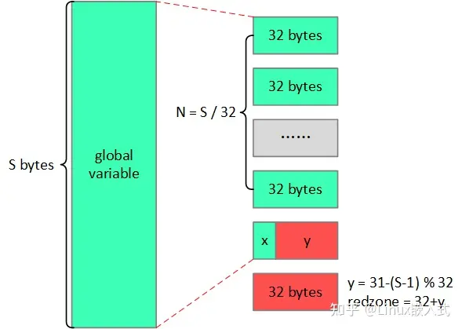

全局变量redzone区域对应的shadow memory是在什么填充的呢？又是如何调用的呢？这部分是由编译器帮我们完成的。编译器会为每一个全局变量创建一个函数，函数名称是：_GLOBAL__sub_I_65535_1_##global_variable_name。这个函数中通过调用__asan_register_globals()函数完成shadow memory标记。并且将自动生成的这个函数的首地址放在.init_array段。在kernel启动阶段，通过以下代调用关系最终调用所有全局变量的构造函数。kernel_init_freeable()->do_basic_setup() ->do_ctors()。do_ctors()代码实现如下：

```cpp
static void __init do_ctors(void)
{
 ctor_fn_t *fn = (ctor_fn_t *) __ctors_start;
 for (; fn < (ctor_fn_t *) __ctors_end; fn++)
 (*fn)();
}
```

这里的代码意思对于轻车熟路的你再熟悉不过了吧。因为内核中这么搞的太多了。便利__ctors_start和__ctors_end之间的所有数据，作为函数地址进行调用，即完成了所有的global variables的shadow memory初始化。我们可以从链接脚本中知道__ctors_start和__ctors_end的意思。

```cpp
#define KERNEL_CTORS()  . = ALIGN(8);              \
            VMLINUX_SYMBOL(__ctors_start) = .; \
            KEEP(*(.ctors))            \
            KEEP(*(SORT(.init_array.*)))       \
            KEEP(*(.init_array))           \
            VMLINUX_SYMBOL(__ctors_end) = .;
```

上面说了这么多，不知道你是否产生了疑心？怎么都是猜啊！猜的能准确吗？是的，我也这么觉得。是骡子是马，拉出来溜溜呗！现在用事实说话。首先我创建一个c文件drivers/input/smc.c。在smc.c文件中创建3个全局变量如下：


然后就随便使用吧！编译kernel，我们先看看System.map文件中，3个全局变量分配的地址。

```cpp
ffff200009f540e0 B smc_num1
ffff200009f54120 B smc_num2
ffff200009f54160 B smc_num3
```

还记得上面说会有一个形如_GLOBAL__sub_I_65535_1_##global_variable_name的函数吗？在System.map文件文件中，我看到了_GLOBAL__sub_I_65535_1_smc_num1符号。但是没有smc_num2和smc_num3的构造函数。你是不是很奇怪，不是每一个全局变量都会创建一个类似的构造函数吗？马上为你揭晓。我们先执行aarch64-linux-gnu-objdump –s –x –d vmlinux > vmlinux.txt命令得到反编译文件。现在好多重要的信息在vmlinux.txt。现在主要就是查看vmlinux.txt文件。先看一下_GLOBAL__sub_I_65535_1_smc_num1函数的实现。

```cpp
ffff200009381df0 <_GLOBAL__sub_I_65535_1_smc_num1>:
ffff200009381df0:   a9bf7bfd    stp x29, x30, [sp,#-16]!
ffff200009381df4:   b0001800    adrp    x0, ffff200009682000
ffff200009381df8:   91308000    add x0, x0, #0xc20
ffff200009381dfc:   d2800061    mov x1, #0x3                    // #3
ffff200009381e00:   910003fd    mov x29, sp
ffff200009381e04:   9100c000    add x0, x0, #0x30
ffff200009381e08:   97c09fb8    bl  ffff2000083a9ce8 <__asan_register_globals>
ffff200009381e0c:   a8c17bfd    ldp x29, x30, [sp],#16
ffff200009381e10:   d65f03c0    ret
```

汇编和C语言传递参数在ARM64平台使用的是x0~x7。通过上面的汇编计算一下，x0=0xffff200009682c50，x1=3。然后调用__asan_register_globals()函数，x0和x1就是传递的参数。我们看一下__asan_register_globals()函数实现。

```cpp
void __asan_register_globals(struct kasan_global *globals, size_t size)
{
    int i;
    for (i = 0; i < size; i++)
        register_global(&globals[i]);
}
```

size是3就是要初始化全局变量的个数，所以这里只需要一个构造函数即可。一次性将3个全局变量全部搞定。这里再说一点猜测吧！我猜测是以文件为单位编译器创建一个构造函数即可，将本文件全局变量一次性全部打包初始化。第一个参数globals是0xffff200009682c50，继续从vmlinux.txt中查看该地址处的数据。struct kasan_global是编译器帮我们自动创建的结构体，每一个全局变量对应一个struct kasan_global结构体。struct kasan_global结构体存放的位置是.data段，因此我们可以从.data段查找当前地址对应的数据。数据如下：

```cpp
ffff200009682c50 6041f509 0020ffff 07000000 00000000
ffff200009682c60 40000000 00000000 d0d62b09 0020ffff
ffff200009682c70 b8d62b09 0020ffff 00000000 00000000
ffff200009682c80 202c6809 0020ffff 2041f509 0020ffff
ffff200009682c90 1f000000 00000000 40000000 00000000
ffff200009682ca0 e0d62b09 0020ffff b8d62b09 0020ffff
ffff200009682cb0 00000000 00000000 302c6809 0020ffff
ffff200009682cc0 e040f509 0020ffff 04000000 00000000
ffff200009682cd0 40000000 00000000 f0d62b09 0020ffff
ffff200009682ce0 b8d62b09 0020ffff 00000000 00000000
```

首先ffff200009682c50对应的第一个数据6041f509 0020ffff，这是个啥？其实是一个地址数据，你是不是又疑问了，ARM64的kernel space地址不是ffff开头吗？这个怎么60开头？其实这个地址数据是反过来的，你应该从右向左看。这个地址其实是ffff200009f54160。这不正是smc_num3的地址嘛！解析这段数据之前需要了解一下struct kasan_global结构体。

```text
/* The layout of struct dictated by compiler */
struct kasan_global {
    const void *beg;        /* Address of the beginning of the global variable. */
    size_t size;            /* Size of the global variable. */
    size_t size_with_redzone;   /* Size of the variable + size of the red zone. 32 bytes aligned */
    const void *name;
    const void *module_name;    /* Name of the module where the global variable is declared. */
    unsigned long has_dynamic_init; /* This needed for C++ */
#if KASAN_ABI_VERSION >= 4
    struct kasan_source_location *location;
#endif
};
```

第一个成员beg就是全局变量的首地址。跟上面的分析一致。第二个成员size从上面数据看出是7，正好对应我们定义的smc_num3[7]，正好7 bytes。size_with_redzone的值是0x40，正好是64。根据上面猜测redzone=63-(7-1)%32=57。加上size正好是64，说明之前猜测的redzone计算方法没错。name成员对应的地址是ffff2000092bd6d0。看下ffff2000092bd6d0存储的是什么。

```text
ffff2000092bd6d0 736d635f 6e756d33 00000000 00000000  smc_num3........
```

所以name就是全局变量的名称转换成字符串。同样的方式得到module_name的地址是ffff2000092bd6b8。继续看看这段地址存储的数据。

```cpp
ffff2000092bd6b0 65000000 00000000 64726976 6572732f  e.......drivers/
ffff2000092bd6c0 696e7075 742f736d 632e6300 00000000  input/smc.c.....
```

一目了然，module_name是文件的路径。has_dynamic_init的值就是0，这是C++需要的。我用的GCC版本是5.0左右，所以这里的KASAN_ABI_VERSION=4。这里location成员的地址是ffff200009682c20，继续追踪该地址的数据。

ffff200009682c20 b8d62b09 0020ffff 0e000000 0f000000

解析这段数据之前要先了解struct kasan_source_location结构体。

```cpp
/* The layout of struct dictated by compiler */
struct kasan_source_location {
    const char *filename;
    int line_no;
    int column_no;
};
```

第一个成员filename地址是ffff2000092bd6b8和module_name一样的数据。剩下两个数据分别是14和15，分别代表全局变量定义地方的行号和列号。现在回到上面我定义变量的截图，仔细数数列号是不是15，行号截图中也有哦！特地截出来给你看的。剩下的struct kasan_global数据就是smc_num1和smc_num2的数据。分析就不说了。前面说_GLOBAL__sub_I_65535_1_smc_num1函数会被自动调用，该地址数据填充在__ctors_start和__ctors_end之间。现在也证明一下观点。先从System.map得到符号的地址数据。

```cpp
ffff2000093ac5d8 T __ctors_start
ffff2000093ae860 T __ctors_end
```

然后搜索一下_GLOBAL__sub_I_65535_1_smc_num1的地址ffff200009381df0被存储在什么位置，记得搜索的关键字是f01d3809 0020ffff。

```cpp
ffff2000093ae0c0 f01d3809 0020ffff 181e3809 0020ffff
```

可以看出ffff2000093ae0c0地址处存储着_GLOBAL__sub_I_65535_1_smc_num1函数地址。这个地址不是正好位于__ctors_start和__ctors_end之间嘛！

现在就剩下__asan_register_globals()函数到底是是怎么初始化shadow memory的呢？以char a[4]为例，如下图所示。

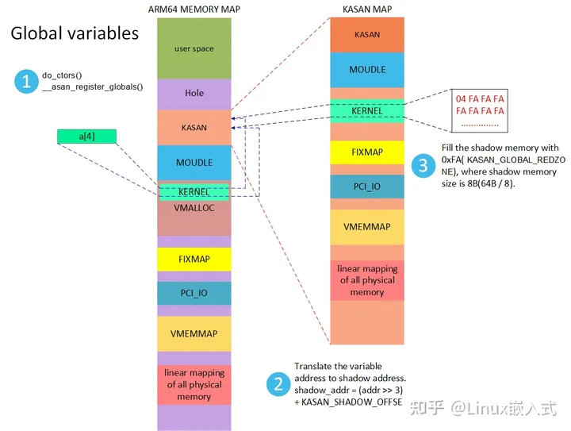

a[4]只有4 bytes可以访问，所以对应的shadow memory的第一个byte值是4，后面的redzone就填充0xFA作为越界检测。a[4]只有4 bytes可以访问，所以对应的shadow memory的第一个byte值是4，后面的redzone就填充0xFA作为越界检测。因为这里是全局变量，因此分配的内存区域位于kernel区域。

### 栈分配变量的readzone是如何分配的？

从栈中分配的变量同样和全局变量一样需要填充一些内存作为redzone区域。下面继续举个例子说明编译器怎么填充。首先来一段正常的代码，没有编译器的插手。

```cpp
void foo()
{
    char a[328];
}
```

再来看看编译器插了哪些东西进去。

```cpp
void foo()
{
    char rz1[32];
    char a[328];
    char rz2[56];
    int *shadow = （&rz1 >> 3）+ KASAN_SHADOW_OFFSE;
    shadow[0] = 0xffffffff;
    shadow[11] = 0xffffff00;
    shadow[12] = 0xffffffff;
------------------------使用完毕----------------------------------------
    shadow[0] = shadow[11] = shadow[12] = 0;
}
```

红色部分是编译器填充内存，rz2是56，可以根据上一节全局变量的公式套用计算得到。但是这里在变量前面竟然还有32 bytes的rz1。这个是和全局变量的不同，我猜测这里是为了检测栈变量左边界越界问题。蓝色部分代码也是编译器填充，初始化shadow memory。栈的填充就没有探究那么深入了，有兴趣的读者可以自己探究。

## Error log信息包含哪些信息？

从kernel的Documentation文档找份典型的KASAN bug输出的log信息如下。

```cpp
==================================================================
BUG: AddressSanitizer: out of bounds access in kmalloc_oob_right+0x65/0x75 [test_kasan] at addr ffff8800693bc5d3
Write of size 1 by task modprobe/1689
=============================================================================
BUG kmalloc-128 (Not tainted): kasan error
-----------------------------------------------------------------------------

Disabling lock debugging due to kernel taint
INFO: Allocated in kmalloc_oob_right+0x3d/0x75 [test_kasan] age=0 cpu=0 pid=1689
 __slab_alloc+0x4b4/0x4f0
 kmem_cache_alloc_trace+0x10b/0x190
 kmalloc_oob_right+0x3d/0x75 [test_kasan]
 init_module+0x9/0x47 [test_kasan]
 do_one_initcall+0x99/0x200
 load_module+0x2cb3/0x3b20
 SyS_finit_module+0x76/0x80
 system_call_fastpath+0x12/0x17
INFO: Slab 0xffffea0001a4ef00 objects=17 used=7 fp=0xffff8800693bd728 flags=0x100000000004080
INFO: Object 0xffff8800693bc558 @offset=1368 fp=0xffff8800693bc720
Bytes b4 ffff8800693bc548: 00 00 00 00 00 00 00 00 5a 5a 5a 5a 5a 5a 5a 5a  ........ZZZZZZZZ
Object ffff8800693bc558: 6b 6b 6b 6b 6b 6b 6b 6b 6b 6b 6b 6b 6b 6b 6b 6b  kkkkkkkkkkkkkkkk
Object ffff8800693bc568: 6b 6b 6b 6b 6b 6b 6b 6b 6b 6b 6b 6b 6b 6b 6b 6b  kkkkkkkkkkkkkkkk
Object ffff8800693bc578: 6b 6b 6b 6b 6b 6b 6b 6b 6b 6b 6b 6b 6b 6b 6b 6b  kkkkkkkkkkkkkkkk
Object ffff8800693bc588: 6b 6b 6b 6b 6b 6b 6b 6b 6b 6b 6b 6b 6b 6b 6b 6b  kkkkkkkkkkkkkkkk
Object ffff8800693bc598: 6b 6b 6b 6b 6b 6b 6b 6b 6b 6b 6b 6b 6b 6b 6b 6b  kkkkkkkkkkkkkkkk
Object ffff8800693bc5a8: 6b 6b 6b 6b 6b 6b 6b 6b 6b 6b 6b 6b 6b 6b 6b 6b  kkkkkkkkkkkkkkkk
Object ffff8800693bc5b8: 6b 6b 6b 6b 6b 6b 6b 6b 6b 6b 6b 6b 6b 6b 6b 6b  kkkkkkkkkkkkkkkk
Object ffff8800693bc5c8: 6b 6b 6b 6b 6b 6b 6b 6b 6b 6b 6b 6b 6b 6b 6b a5  kkkkkkkkkkkkkkk.
Redzone ffff8800693bc5d8: cc cc cc cc cc cc cc cc                          ........
Padding ffff8800693bc718: 5a 5a 5a 5a 5a 5a 5a 5a                          ZZZZZZZZ
CPU: 0 PID: 1689 Comm: modprobe Tainted: G    B          3.18.0-rc1-mm1+ #98
Hardware name: QEMU Standard PC (i440FX + PIIX, 1996), BIOS rel-1.7.5-0-ge51488c-20140602_164612-nilsson.home.kraxel.org 04/01/2014
 ffff8800693bc000 0000000000000000 ffff8800693bc558 ffff88006923bb78
 ffffffff81cc68ae 00000000000000f3 ffff88006d407600 ffff88006923bba8
 ffffffff811fd848 ffff88006d407600 ffffea0001a4ef00 ffff8800693bc558
Call Trace:
 [<ffffffff81cc68ae>] dump_stack+0x46/0x58
 [<ffffffff811fd848>] print_trailer+0xf8/0x160
 [<ffffffffa00026a7>] ? kmem_cache_oob+0xc3/0xc3 [test_kasan]
 [<ffffffff811ff0f5>] object_err+0x35/0x40
 [<ffffffffa0002065>] ? kmalloc_oob_right+0x65/0x75 [test_kasan]
 [<ffffffff8120b9fa>] kasan_report_error+0x38a/0x3f0
 [<ffffffff8120a79f>] ? kasan_poison_shadow+0x2f/0x40
 [<ffffffff8120b344>] ? kasan_unpoison_shadow+0x14/0x40
 [<ffffffff8120a79f>] ? kasan_poison_shadow+0x2f/0x40
 [<ffffffffa00026a7>] ? kmem_cache_oob+0xc3/0xc3 [test_kasan]
 [<ffffffff8120a995>] __asan_store1+0x75/0xb0
 [<ffffffffa0002601>] ? kmem_cache_oob+0x1d/0xc3 [test_kasan]
 [<ffffffffa0002065>] ? kmalloc_oob_right+0x65/0x75 [test_kasan]
 [<ffffffffa0002065>] kmalloc_oob_right+0x65/0x75 [test_kasan]
 [<ffffffffa00026b0>] init_module+0x9/0x47 [test_kasan]
 [<ffffffff810002d9>] do_one_initcall+0x99/0x200
 [<ffffffff811e4e5c>] ? __vunmap+0xec/0x160
 [<ffffffff81114f63>] load_module+0x2cb3/0x3b20
 [<ffffffff8110fd70>] ? m_show+0x240/0x240
 [<ffffffff81115f06>] SyS_finit_module+0x76/0x80
 [<ffffffff81cd3129>] system_call_fastpath+0x12/0x17
Memory state around the buggy address:
 ffff8800693bc300: fc fc fc fc fc fc fc fc fc fc fc fc fc fc fc fc
 ffff8800693bc380: fc fc 00 00 00 00 00 00 00 00 00 00 00 00 00 fc
 ffff8800693bc400: fc fc fc fc fc fc fc fc fc fc fc fc fc fc fc fc
 ffff8800693bc480: fc fc fc fc fc fc fc fc fc fc fc fc fc fc fc fc
 ffff8800693bc500: fc fc fc fc fc fc fc fc fc fc fc 00 00 00 00 00
>ffff8800693bc580: 00 00 00 00 00 00 00 00 00 00 03 fc fc fc fc fc
                                                                           ^
 ffff8800693bc600: fc fc fc fc fc fc fc fc fc fc fc fc fc fc fc fc
 ffff8800693bc680: fc fc fc fc fc fc fc fc fc fc fc fc fc fc fc fc
 ffff8800693bc700: fc fc fc fc fb fb fb fb fb fb fb fb fb fb fb fb
 ffff8800693bc780: fb fb fb fb fb fb fb fb fb fb fb fb fb fb fb fb
 ffff8800693bc800: fb fb fb fb fb fb fb fb fb fb fb fb fb fb fb fb
==================================================================
```

输出的信息很丰富，包含了bug发生的类型、SLUB输出的object内存信息、Call Trace以及shadow memory的状态值。其中红色信息都是比较重要的信息。我没有写demo历程，而是找了一份log信息，不是我想偷懒，而是锻炼自己。怎么锻炼呢？我想问的是，从这份log中你可以推测代码应该是怎么样的？我可以得到一下信息：

1) 程序是通过kmalloc接口申请内存的；

2) 申请的内存大小是123 bytes，即p = kamlloc(123);

3) 代码中类似往p[123]中写1 bytes导致越界访问的bug；

4) 在3)步骤发生前没有任何的对该内存的写操作；

如果你也能得到以上4点猜测，我觉的我写的这几篇文章你是真的看明白了。首先输出信息是有SLUB的信息，所以应该是通过kmalloc()接口；在打印的shadow memory的值中，我们看到连续的15个0和一个3，所以申请的内存size就是15x8+3=123；由于是往ffff8800693bc5d3地址写1个字节，并且object首地址是ffff8800693bc558，所以推测是往p[123]写1 byte出问题；由于log中将object中所有的128 bytes数据全部打印出来，一共是127个0x6b和一个0xa5（SLUB DEBUG文章介绍的内容）。所以我推测在3)步骤发生前没有任何的对该内存的写操作。

## 补充

我看了linux-4.18的代码，KASAN的log输出已经发生了部分变化。例如：上面举例的SLUB的object的内容就不会打印了。我们用一下的程序展示这些变化（实际上就是上面举例用的程序）。


针对以上代码，KASAN检测到bug后的输出log如下：

```cpp
==================================================================
BUG: KASAN: slab-out-of-bounds in kmalloc_oob_right+0x6c/0x8c
Write of size 1 at addr ffffffc0cb114d7b by task swapper/0/1

CPU: 4 PID: 1 Comm: swapper/0 Tainted: G S      W       4.9.82-perf+ #310
Hardware name: Qualcomm Technologies, Inc. SDM632 PMI632
Call trace:
[<ffffff90cf88d9f8>] dump_backtrace+0x0/0x320
[<ffffff90cf88dd2c>] show_stack+0x14/0x20
[<ffffff90cfdd1148>] dump_stack+0xa8/0xd0
[<ffffff90cfabf298>] print_address_description+0x60/0x250
[<ffffff90cfabf6a0>] kasan_report.part.2+0x218/0x2f0
[<ffffff90cfabfac0>] kasan_report+0x20/0x28
[<ffffff90cfabdc64>] __asan_store1+0x4c/0x58
[<ffffff90d1a4f760>] kmalloc_oob_right+0x6c/0x8c
[<ffffff90d1a50448>] kmalloc_tests_init+0xc/0x68
[<ffffff90cf8845dc>] do_one_initcall+0xa4/0x1f0
[<ffffff90d1a011ac>] kernel_init_freeable+0x244/0x300
[<ffffff90d0d6da70>] kernel_init+0x10/0x110
[<ffffff90cf8842a0>] ret_from_fork+0x10/0x30

Allocated by task 1:
 kasan_kmalloc+0xd8/0x188
 kmem_cache_alloc_trace+0x130/0x248
 kmalloc_oob_right+0x4c/0x8c
 kmalloc_tests_init+0xc/0x68
 do_one_initcall+0xa4/0x1f0
 kernel_init_freeable+0x244/0x300
 kernel_init+0x10/0x110
 ret_from_fork+0x10/0x30

Freed by task 1:
 kasan_slab_free+0x88/0x178
 kfree+0x84/0x298
 kobject_uevent_env+0x144/0x620
 kobject_uevent+0x10/0x18
 device_add+0x5f8/0x860
 amba_device_try_add+0x22c/0x2f8
 amba_device_add+0x20/0x128
 of_platform_bus_create+0x390/0x478
 of_platform_bus_create+0x21c/0x478
 of_platform_populate+0x4c/0xb8
 of_platform_default_populate_init+0x78/0x8c
 do_one_initcall+0xa4/0x1f0
 kernel_init_freeable+0x244/0x300
 kernel_init+0x10/0x110
 ret_from_fork+0x10/0x30

The buggy address belongs to the object at ffffffc0cb114d00
 which belongs to the cache kmalloc-128 of size 128
The buggy address is located 123 bytes inside of
 128-byte region [ffffffc0cb114d00, ffffffc0cb114d80)
The buggy address belongs to the page:
page:ffffffbf032c4500 count:1 mapcount:0 mapping: (null) index:0xffffffc0cb115200 compound_mapcount: 0
flags: 0x4080(slab|head)
page dumped because: kasan: bad access detected

Memory state around the buggy address:
 ffffffc0cb114c00: fc fc fc fc fc fc fc fc fc fc fc fc fc fc fc fc
 ffffffc0cb114c80: fc fc fc fc fc fc fc fc fc fc fc fc fc fc fc fc
>ffffffc0cb114d00: 00 00 00 00 00 00 00 00 00 00 00 00 00 00 00 03
                                                                ^
 ffffffc0cb114d80: fc fc fc fc fc fc fc fc fc fc fc fc fc fc fc fc
 ffffffc0cb114e00: fc fc fc fc fc fc fc fc fc fc fc fc fc fc fc fc
==================================================================
```

我们从上面的log可以分析如下数据：

- line2：发生越界访问位置。  

- line3：越界写1个字节，写的地址是0xffffffc0cb114d7b。当前进程是comm是swapper/0，pid是1。  

- line7：Call trace，方便定位出问题的函数调用关系。  

- line22：该object分配的调用栈，并指出分配内存的进程pid是1。  

- line32：释放该object的调用栈（上次释放），并指出释放内存的进程pid是1。  

- line49：指出slub相关的信息，从“kmalloc-28”的kmem_cache分配的object。object起始地址是0xffffffc0cb114d00。  

- line51：访问出问题的地址位于object起始地址偏移123 bytes的位置。object的地址范围是[0xffffffc0cb114d00, 0xffffffc0cb114d80)。object实际大小是128 bytes。  

- line61：出问题地址对应的shadow memory的值，可以确定申请内存的实际大小是123 bytes。
  
  **对比**

和 KASan 功能类似的工具还有 kmemcheck，它比 KASan 更早加入内核，但是运行速度没有 KASan 快，这是因为 KASan 利用了编译器的特性，可以将代码编译为內联模式。但 KASan 也有自己的不足，目前 KASan 不能检测出读取未初始化内存的错误，而这一点 kmemcheck 是支持的。
