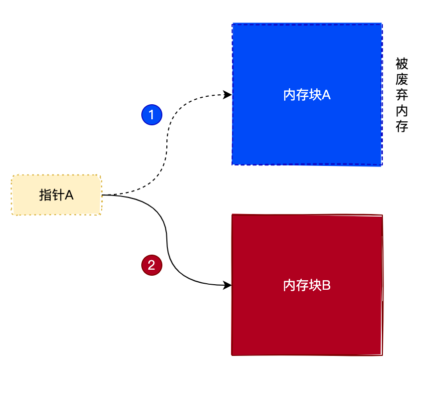
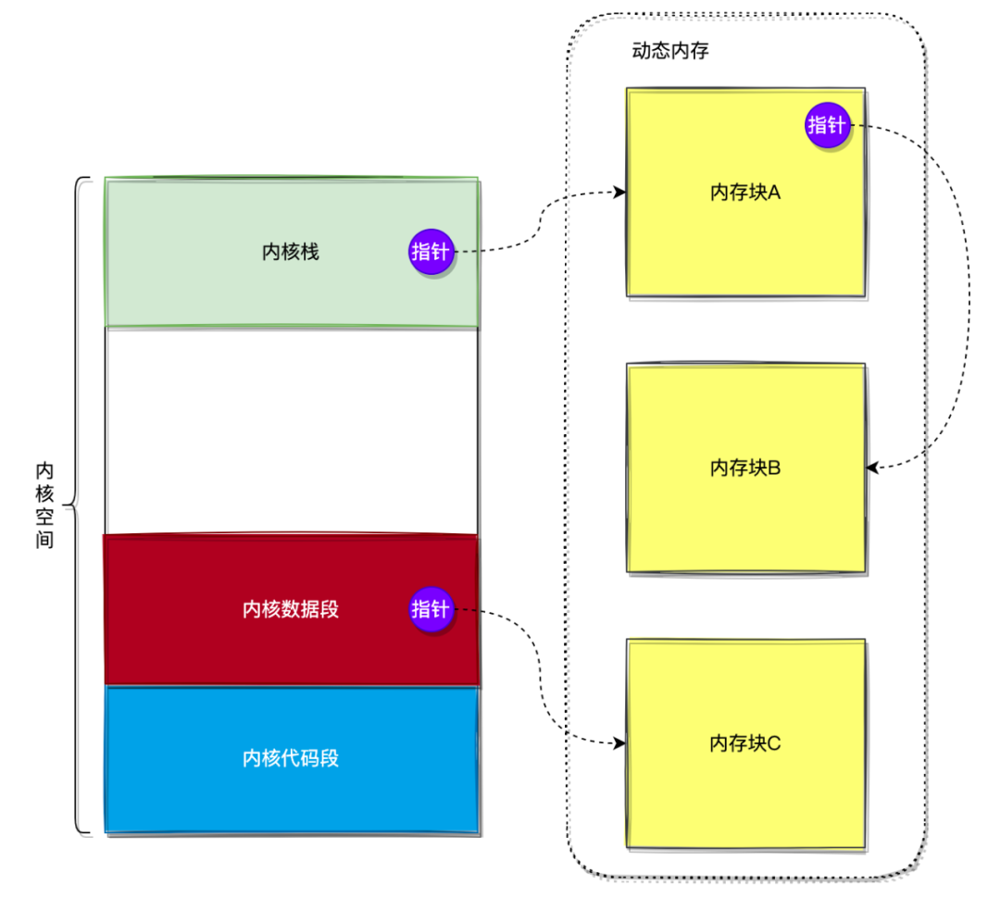
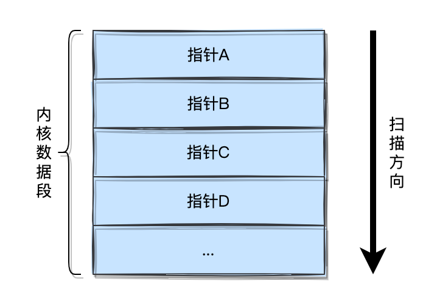
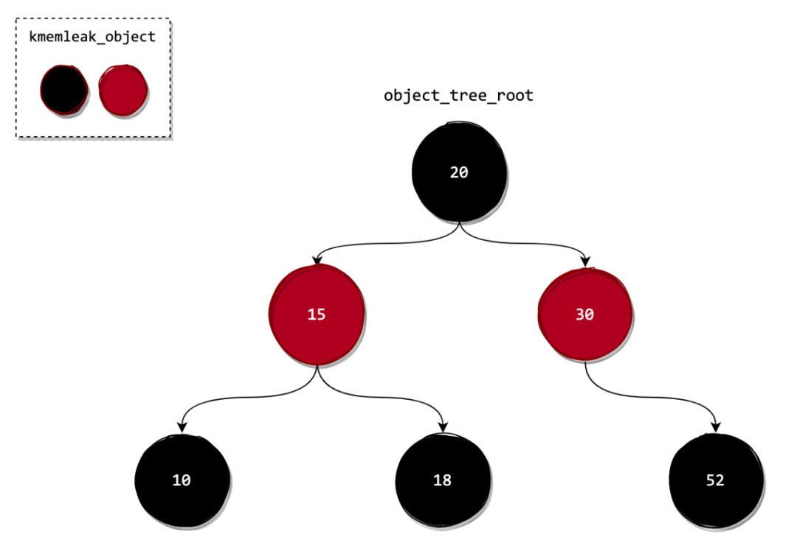

在使用没有垃圾回收的语言时（如 C/C++），可能由于忘记释放内存而导致内存被耗尽，这叫 `内存泄漏`。由于内核也需要自己管理内存，所以也可能出现内存泄漏的情况。为了能够找出导致内存泄漏的地方，Linux 内核开发者开发出 kmemleak 功能。

下面我们来详细介绍一下 kmemleak 这个功能的原理与实现。

## kmemleak 原理

首先来分析一下，什么情况会导致 `内存泄漏`。

### 1. 造成内存泄漏的原因

内存泄漏的根本原因是由于用户没有释放不再使用的动态申请的内存（在内核中由 `memblock_alloc`、`kmalloc`、`vmalloc`、`kmem_cache_alloc` 等函数申请的内存），那么哪些内存是不再使用的呢？一般来说，没有被指针引用（指向）的内存都是不再使用的内存。因为这些内存已经丢失了其地址信息，从而导致内核不能再使用这些内存。

我们来看看下图的事例：



如上图所示，指针A原来指向内存块A，但后来指向新申请的内存块B，从而导致内存块A的内存地址信息丢失。如果此时用户没有及时释放掉内存块A，就会导致内存泄漏。

当然少量的内存泄漏并不会造成很严重的效果，但如果是频发性的内存泄漏，将会造成系统内存资源耗尽，从而导致系统崩溃。

### 2. 内核中的指针

既然没有指针引用的内存属于泄漏的内存，那么只需要找出系统是否存在没有指针引用的内存，就可以判断系统是否存在内存泄漏。

那么，怎么找到内核中的所有指针呢？我们知道，指针一般存放在 `内核数据段`、`内核栈` 和 `动态申请的内存块` 中。如下图所示：



但内核并没有对指针进行记录，也就是说内核并不知道这些区域是否存在指针。那么内核只能够把这些区域当成是由指针组成的，也就是说把这些区域中的每个元素都当成是一个指针。如下图所示：



当然，把所有元素都当成是指针是一个假设，所以会存在误判的情况。不过这也没关系，因为 `kmemleak` 这个功能只是为了找到内核中疑似内存泄漏的地方。

### 3. 记录动态内存块

前面说过，kmemleak 机制用于分析由 `memblock_alloc`、`kmalloc`、`vmalloc`、`kmem_cache_alloc` 等函数申请的内存是否存在泄漏。

分析的依据是：扫描内核中所有的指针，然后判断这些指针是否指向了由 `memblock_alloc`、`kmalloc`、`vmalloc`、`kmem_cache_alloc` 等函数申请的内存块。如果存在没有指针引用的内存块，那么就表示可能存在内存泄漏。

所以，当使用 `memblock_alloc`、`kmalloc`、`vmalloc`、`kmem_cache_alloc` 等函数申请内存时，内核会把申请到的内存块信息记录下来，用于后续扫描时使用。内核使用 `kmemleak_object` 对象来记录这些内存块的信息，然后通过一棵红黑树把这些 `kmemleak_object` 对象组织起来（使用内存块的地址作为键），如下图所示：



所以内存泄漏检测的原理是：

- 遍历内核中所有的指针，然后从红黑树中查找是否存在对应的内存块，如果存在就把内存块打上标记。

- 所有指针扫描完毕后，再遍历红黑树中所有 `kmemleak_object` 对象。如果发现没有打上标记的内存块，说明存在内存泄漏（也就是说，存在没有被指针引用的内存块），并且将对应的内存块信息记录下来。

## kmemleak 实现

了解了 kmemleak 机制的原理后，现在我们来分析其代码实现。

### 1. kmemleak_object 对象

上面介绍过，内核通过 `kmemleak_object` 对象来记录动态内存块的信息，其定义如下：

```c
struct kmemleak_object {
    spinlock_t lock;
    unsigned long flags;        /* object status flags */
    struct list_head object_list;
    struct list_head gray_list;
    struct rb_node rb_node;
    ...
    atomic_t use_count;
    unsigned long pointer;
    size_t size;
    int min_count;
    int count;
    ...
    pid_t pid;                  /* pid of the current task */
    char comm[TASK_COMM_LEN];   /* executable name */
};ot);

out:
    ...
    return object;
}
```

`kmemleak_object` 对象的成员字段比较多，现在我们重点关注 `rb_node` 、`pointer` 和 `size` 这 3 个字段：

- `rb_node`：此字段用于将 `kmemleak_object` 对象连接到红黑树中。

- `pointer`：用于记录内存块的起始地址。

- `size`：用于记录内存块的大小。

内核就是通过这 3 个字段，把 `kmemleak_object` 对象连接到全局红黑树中。

例如利用 `kmalloc` 函数申请内存时，最终会调用 `create_object` 来创建 `kmemleak_object` 对象，并且将其添加到全局红黑树中。我们来看看 `create_obiect` 函数的实现，如下：

```c
...
// 红黑树的根节点
static struct rb_root object_tree_root = RB_ROOT;
...

static struct kmemleak_object *
create_object(unsigned long ptr, size_t size, int min_count, gfp_t gfp)
{
    unsigned long flags;
    struct kmemleak_object *object, *parent;
    struct rb_node **link, *rb_parent;

    // 申请一个新的 kmemleak_object 对象
    object = kmem_cache_alloc(object_cache, gfp_kmemleak_mask(gfp));
    ...
    object->pointer = ptr;
    object->size = size;

    // 将新申请的 kmemleak_object 对象添加到全局红黑树中
    ...
    link = &object_tree_root.rb_node; // 红黑树根节点
    rb_parent = NULL;

   // 找到 kmemleak_object 对象插入的位置（参考平衡二叉树的算法）
    while (*link) {
        rb_parent = *link;
        parent = rb_entry(rb_parent, struct kmemleak_object, rb_node);
        if (ptr + size <= parent->pointer)
            link = &parent->rb_node.rb_left;
        else if (parent->pointer + parent->size <= ptr)
            link = &parent->rb_node.rb_right;
        else {
            ...
            goto out;
        }
    }

   // 将 kmemleak_object 对象插入到红黑树中
    rb_link_node(&object->rb_node, rb_parent, link);
    rb_insert_color(&object->rb_node, &object_tree_root);

out:
    ...
    return object;
}
```

虽然 `create_obiect` 函数的代码比较长，但是逻辑却很简单，主要完成 2 件事情：

- 申请一个新的 `kmemleak_object` 对象，并且初始化其各个字段。

- 将新申请的 `kmemleak_object` 对象添加到全局红黑树中。

> 将 `kmemleak_object` 对象插入到全局红黑树的算法与数据结构中的平衡二叉树算法是一致的，所以不了解的同学可以查阅相关的资料。

### 2. 内存泄漏检测

当开启内存泄漏检测时，内核将会创建一个名为 `kmemleak` 的内核线程来进行检测。

在分析内存检测的实现之前，我们先来了解一下关于 `kmemleak_object` 对象的三个概念：

- **白色节点**：表示此对象没有被指针引用（`count` 字段少于 `min_count` 字段）。

- **灰色节点**：表示此对象被一个或多个指针引用（`count` 字段大于或等于 `min_count` 字段）。

- **黑色节点**：表示此对象不需要被扫描（`min_count` 字段等于 -1）。

接着我们来看看 `kmemleak` 内核线程的实现：

```c
static int kmemleak_scan_thread(void *arg)
{
    ...
    while (!kthread_should_stop()) {
        ...
        kmemleak_scan(); // 进行内存泄漏扫描
        ...
    }
    return 0;
}
```

可以看出 `kmemleak` 内核线程主要通过调用 `kmemleak_scan` 函数来进行内存泄漏扫描。我们继续来看看 `kmemleak_scan` 函数的实现：

```c
static void kmemleak_scan(void)
{
    ...
    // 1) 将所有 kmemleak_object 对象的 count 字段置0，表示开始时全部是白色节点
    list_for_each_entry_rcu(object, &object_list, object_list) {
        ...
        object->count = 0;
        ...
    }
    ...

    // 2) 扫描数据段与未初始化数据段
    scan_block(_sdata, _edata, NULL, 1);
    scan_block(__bss_start, __bss_stop, NULL, 1);
    ...

    // 3) 扫描所有内存页结构，这是由于内存页结构也可能引用其他内存块
    for_each_online_node(i) {
        ...
        for (pfn = start_pfn; pfn < end_pfn; pfn++) {
            ...
            page = pfn_to_page(pfn);
            ...
            scan_block(page, page + 1, NULL, 1);
        }
    }
    ...

    // 4) 扫描所有进程的内核栈
    if (kmemleak_stack_scan) {
        ...
        do_each_thread(g, p) {
            scan_block(task_stack_page(p), task_stack_page(p) + THREAD_SIZE, NULL, 0);
        } while_each_thread(g, p);
        ...
    }

    // 5) 扫描所有灰色节点
    scan_gray_list();
    ...
}
```

由于 `kmemleak_scan` 函数的代码比较长，所以我们对其进行精简。精简后可以看出，`kmemleak_scan` 函数主要完成 5 件事情：

- 将系统中所有 `kmemleak_object` 对象的 `count` 字段置 0，表示扫描开始时，所有节点都是白色节点。

- 调用 `scan_block` 函数扫描 `数据段` 与 `未初始化数据段`，因为这两个区域可能存在指针。

- 扫描所有 `内存页结构`，这是因为内存页结构可能会引用其他内存块，所以也要对其进行扫描。

- 扫描所有 `进程内核栈`，由于进程内核栈可能存在指针，所以要对其进行扫描。

- 扫描所有 `灰色节点`，由于灰色节点也可能存在指针，所以要对其进行扫描。

扫描主要通过 `scan_block` 函数进行，我们来看看 `scan_block` 函数的实现：

```
static voidscan_block(void *_start, void *_end, struct kmemleak_object *scanned,           int allow_resched){    unsigned long *ptr;    unsigned long *start = PTR_ALIGN(_start, BYTES_PER_POINTER);    unsigned long *end = _end - (BYTES_PER_POINTER - 1);    // 对内存区进行扫描    for (ptr = start; ptr < end; ptr++) {        struct kmemleak_object *object;        unsigned long flags;        unsigned long pointer;        ...        pointer = *ptr;        // 查找指针所引用的内存块是否存在于红黑树中，如果不存在就跳过此指针        object = find_and_get_object(pointer, 1);        if (!object)            continue;        ...        // 如果对象不是白色，说明此内存块已经被指针引用        if (!color_white(object)) {            ...            continue;        }        // 对 kmemleak_object 对象的count字段进行加一操作        object->count++;        // 判断当前对象是否灰色节点，如果是将其添加到灰色节点链表中        if (color_gray(object)) {            list_add_tail(&object->gray_list, &gray_list);            ...            continue;        }        ...    }}
```

`scan_block` 函数主要完成以下几个步骤：

- 遍历内存区所有指针。

- 查找指针所引用的内存块是否存在于红黑树中，如果不存在就跳过处理此对象。

- 如果 `kmemleak_object` 对象不是白色，说明已经有指针引用此内存块，跳过处理此对象。

- 对 `kmemleak_object` 对象的 `count` 字段进行加一操作，表示有指针引用此内存块。

- 判断当前 `kmemleak_object` 对象是否是灰色节点（`count` 字段大于或等于 `min_count` 字段），如果是将其添加到灰色节点链表中。

扫描完毕后，所有白色的节点就是可能存在内存泄漏的内存块。
