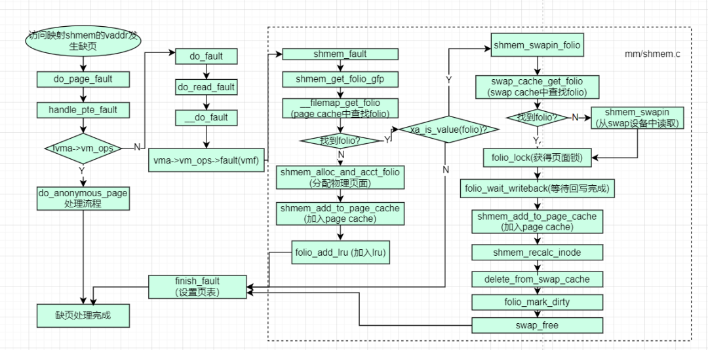
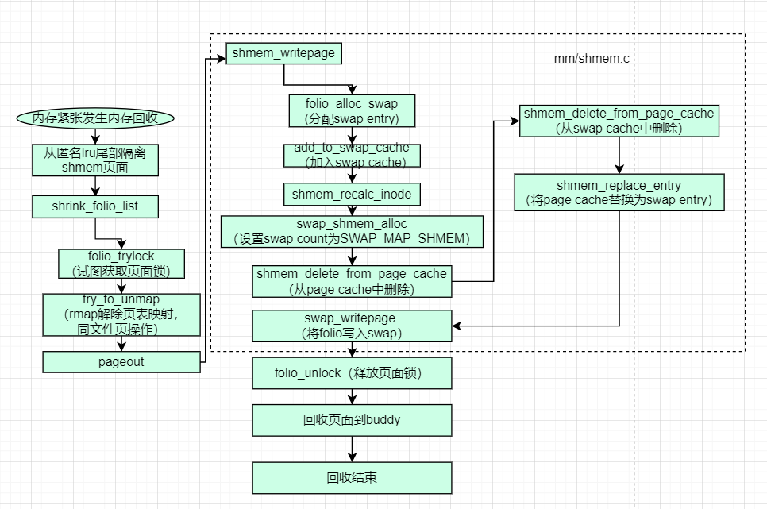
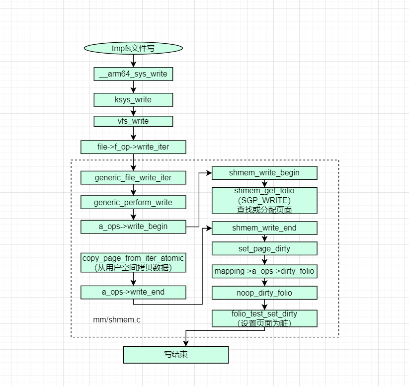

共享内存分为两种，一种是共享文件页面，有tmpfs实现,另一种是共享匿名页面，由shmem实现，

# tmpfs，在相同启动时初始化

```c
kernel_init
    ->kernel_init_freeable
        ->do_basic_setup
            ->do_initcalls
                ->shmem_init
```

# 对于匿名共享页面，在调用mmap时

```c
//用mmap建立共享映射
SSCALL_DEFINE6(mmap
    ->ksys_mmap_pgoff
        ->vm_mmap_pgoff
            ->do_mmap
                ->mmap_region
                    ->shmem_zero_setup  //vma->vm_ops = &shmem_anon_vm_ops; 
//当对共享映射写入数据时
handle_mm_fault
    ->__handle_mm_fault
        ->do_pte_missing
            ->do_fault
                ->do_shared_fault
                    ->shmem_faults //将想入的数据存储到/dev/zero的文件映射空间
//申请共享匿名内存时，用户进程调用shmget建立匿名页面时
shmid = shmget((key_t)12345, sizeof(struct shared_use_st), 0666|IPC_CREAT);
//内核函数调用栈
ksys_shmget
    ->newseg
    ->sprintf(name, "SYSV%08x", key);//文件命名和key有关
    ->shmem_kernel_file_setup
        ->__shmem_file_setup(shm_mnt, name, size, flags, S_PRIVATE);//在tmpfs下创建个文件

//而后用户程序调用shmat建立共享
do_shmat
    ->shm_obtain_object_check(ns, shmid);
    ->do_map
        ->mmap_region
            ->//由于do_map传入了file，所以走文件读写
```

匿名共享页面mmap之后，读写时发生缺页中断，调用关系如下



匿名私有映射和匿名共享映射作用如下


当用户程序调用mmap建立匿名映射后，查看/proc/<pid>/maps


共享内存页面回收，虽然共享内存是以文件形式放在内存中，但在页面回收时会被写到swap分区中




tmpfs读文件


tmpfs写文件


