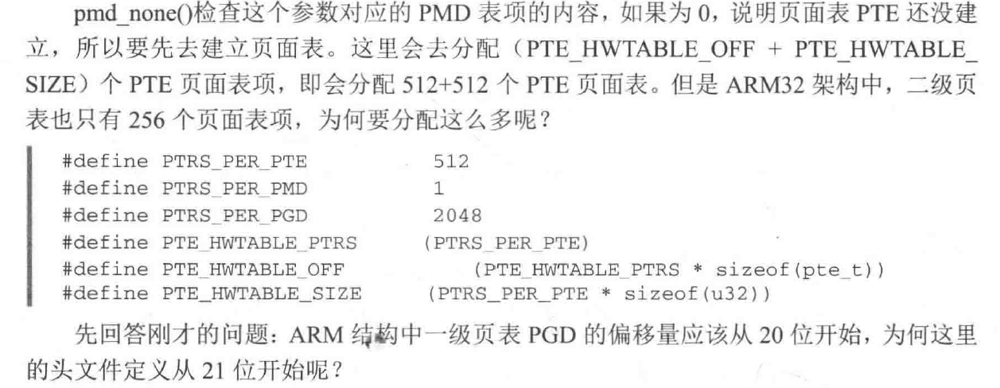

**物理内存架构**


**问题1：arm32一个PAGE放几个PTE**




**问题2：一个巨页的大小和虚拟地址BIT索引有关**


<mark>页面种类（page->flag，page->mapping）</mark>

```c
1，匿名页        (利用page->mapping最低两个bit判断 ) -> 单身匿名页面（page->flag的PG_anon_exclusive位）
2，文件页
3，mlock页        page->flag的PG_Mlocked位
4，GUP pin页        通过增加page->_refcount来pin住页面，比较page->_mapcount和page->_refcount来判断页面是否被pin住
5，THP页            filio->flag与filio->_filio_dtor共同判断    
                PMD-mapped THP ( pmd_val(pmd) && pmd_present(pmd) && !(pmd_val(pmd) & PMD_TABLE_BIT);)   
                PTE-mapped THP   (compound_order(page) == HPAGE_PMD_ORDER  并且pmd_trans_huge（pmd)不成立)
6，hugeTLB页        filio->flag与filio->_filio_dtor共同判断
7，uffd_wp 页    pte_flags（_PAGE_SWP_UFFD_WP和_PAGE_UFFD_WP）和 vma->vm_flags 的 VM_UFFD_WP
8，毒页
9，swap页        !pet_none && ! !pte_present(pte有值，但pte不在内存中，PTE_VALID | PTE_PROT_NONE置位)
                page->flag的PG_swapcache: Swap page: swp_entry_t in private    shrink_page_list->add_to_swap  设置，
                            shrink_page_list->page_check_dirty_writeback 或 shrink_page_list->page_out回写
                            shrink_page_list->__remove_mapping->__delete_from_swap_cache，再清除
                page->flag的PG_swapbacked : Page is backed by RAM/swap 页面可以被swap到操盘，一般匿名页面都会设置
                                do_anonymous_page->page_add_new_anon_rmap会设置
                                do_swap_page->swapin_readahead会设置 看folio_is_file_lru（）的注释
                page->flag的PG_swapbacked 同时标记lazy free页是干净的匿名页，相比普通的匿名页，lazy free页清除了PG_swapbacked
                            在使用过程中，若发现lazy free匿名页变脏，这设置PG_swapbacked
10，writeback页    page->flag的PG_writeback filio正在回写    __folio_start_writeback设置
11，KSM页        folio->mapping设置PAGE_MAPPING_KSM，  set_page_stable_node加入稳定树时设置
```

<mark>映射种类（vma->vm_flags）</mark>

```c
1，共享映射
2，
3，mlock映射    vma->vm_flags & VM_LOCKED

6，hugeTLB映射    vma->vm_flags=VM_HUGETLB
7，uffd 页        vma->vm_flags=VM_UFFD_WP 和vma->vm_flags=VM_UFFD_MISSING
```
