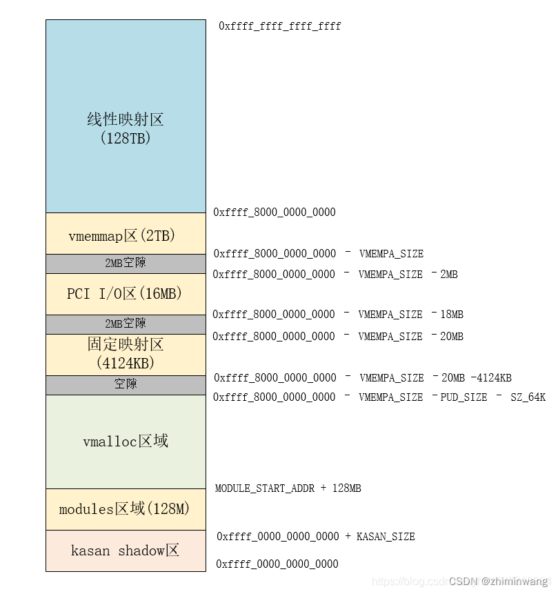

**ARM64内存布局中的vmemmap**

vmemmap是内核中page 数据的虚拟地址。针对sparse内存模型。内核申请page获取的struct page结构体地址从此开始



**page 添加到伙伴系统**

首先确定要添加到伙伴系统的物理地址，然后根据物理地址计算出页帧号，再根据页帧号拿到struct page结构体，然后通过page->lru成员，链接到zone->free_area空闲列表 上。

**vmemmap页表的建立**

sparse_init中，根据物理地址和页帧号确定在vmemmap区中的虚拟地址，之后在申请物理页面建立页表映射

```c
//对于一个page，他的struct page结构体的虚拟地址时确定的
sparse_init
    ->sparse_early_nid
    ->sparse_init_nid
        ->__populate_section_memmap    //为mem_map申请内存，VMEMMAP下内存被映射到了virtual memory map内核空间
            ->算出在virtual memory map中struct page数组的地址范围(确定虚拟地址)
            ->vmemmap_populate    //申请物理页面建立页表
                ->vmemmap_pgd_populate
                    ->vmemmap_alloc_block_zero
                    ->pgd_populate
                ->vmemmap_p4d_populate
                ->vmemmap_pud_populate
                ->vmemmap_pmd_populate
                ->vmemmap_pte_populate
        ->sparse_init_one_section    //将mem_map数组赋值给对应section的指针
```
