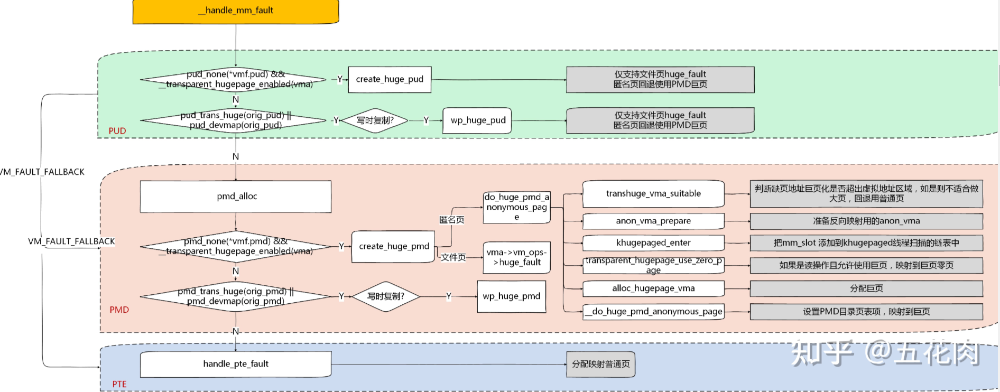
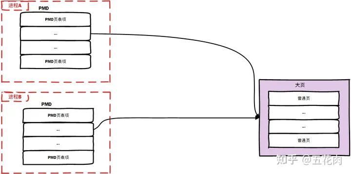
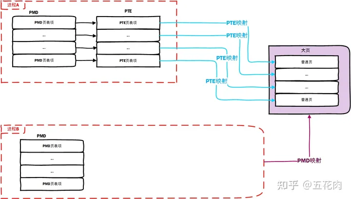
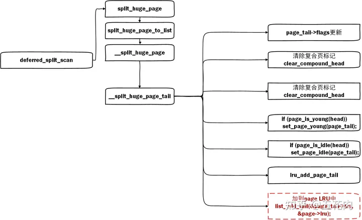

**hugepage_vma_check**

虚拟内存区域vm_area_struct的成员vm_flags增加了以下两个标志：

（1）VM_HUGEPAGE表示允许虚拟内存区域使用透明巨型页，进程使用madvise (MADV_HUGEPAGE)给虚拟内存区域设置这个标志。

（2）VM_NOHUGEPAGE表示不允许虚拟内存区域使用透明巨型页，进程使用madvise(MADV_NOHUGEPAGE)给虚拟内存区域设置这个标志。

注意：标志VM_HUGETLB表示允许使用标准巨型页。

**虚拟内存区域满足以下条件才允许使用透明巨型页。**

（1）以下条件二选一。

1）总是使用透明巨型页。

2）只在进程使用madvise(MADV_HUGEPAGE)指定的虚拟地址范围内使用透明巨型页，并且虚拟内存区域设置了允许使用透明巨型页的标志。

（2）虚拟内存区域没有设置不允许使用透明巨型页的标志。

**问题1：什么样的页会被合并成透明巨页**

（1），如果PMD表项指向PTE，至少一个页有写权限，并且至少一个页刚刚被访问过，那么调用函数collapse_huge_page，把普通页合并成巨型页。如果全部是只读页，或者最近都没有访问过，<u>那么不会合并成巨型页</u>

**问题2：PTE寄存队列**

分配巨型页的时候，会分配PTE页表，把PTE页表添加到pmd_pgtable_page(pmd)->pmd_huge_pte中。当释放巨型页的一部分时，巨型页分裂成普通页，需要从pmd_pgtable_page(pmd)->pmd_huge_pte取一个直接页表。每个PMD页表，包含好多个页表项，每次建立PMD透明巨页时候，都会申请一个PTE页表加入寄存队列，split时候取出来用，


pgtable_trans_huge_withdraw与pgtable_trans_huge_deposit



<mark>**透明大页分裂过程**</mark>

split_huge_pmd这个函数就是只切分一个进程里大页的映射,其他进程里同样的内存空间还可能是大页映射,其他进程是仍然可以享受大页带来的收益

分裂前：



分裂后



拆分页表最终的目的也是为了拆分大页，这样在系统内存不够时可以回收大页中没有使用的部分。最终通过split_huge_page_to_list函数实现拆分大页

进程页表分裂后，其实还是没能进行内存回收。当进程B也发生的页表分裂，那么由于THP大页没有大页映射，会在内存回收时拆分大页。如下所示：


当反向映射时，映射的进程都对某个普通页解除映射后，page的mapcount等于-1，refcount等于0，就可以进行释放了。





**thp测试代码**

```c
#include <stdlib.h>
#include <stdio.h>
#include <unistd.h>
#include <sys/mman.h>
#include <fcntl.h>

#define LENGTH (256UL*1024*1024)
#define PROTECTION (PROT_READ | PROT_WRITE)

#ifndef MAP_HUGETLB
#define MAP_HUGETLB 0x40000 /* arch specific */
#endif

#ifndef MAP_HUGE_SHIFT
#define MAP_HUGE_SHIFT 26
#endif

#ifndef MAP_HUGE_MASK
#define MAP_HUGE_MASK 0x3f
#endif

/* Only ia64 requires this */
#ifdef __ia64__
#define ADDR (void *)(0x8000000000000000UL)
#define FLAGS (MAP_PRIVATE | MAP_ANONYMOUS | MAP_HUGETLB | MAP_FIXED)
#else
#define ADDR (void *)(0x0UL)
#define FLAGS (MAP_PRIVATE | MAP_ANONYMOUS | MAP_HUGETLB)
#endif

static void check_bytes(char *addr)
{
	printf("First hex is %x\n", *((unsigned int *)addr));
}

static void write_bytes(char *addr, size_t length)
{
	unsigned long i;

	for (i = 0; i < length; i++)
		*(addr + i) = (char)i;
}

static int read_bytes(char *addr, size_t length)
{
	unsigned long i;

	check_bytes(addr);
	for (i = 0; i < length; i++)
		if (*(addr + i) != (char)i) {
			printf("Mismatch at %lu\n", i);
			return 1;
		}
	return 0;
}

int main(int argc, char **argv)
{
	void *addr;
	int ret;
	size_t length = LENGTH;
	int flags = FLAGS;
	int shift = 0;
	int i;

	if (argc > 1)
		length = atol(argv[1]) << 20;
	if (argc > 2) {
		shift = atoi(argv[2]);
		/*
		if (shift)
			flags |= (shift & MAP_HUGE_MASK) << MAP_HUGE_SHIFT;
		*/
	}

	if (shift)
		printf("%u kB hugepages\n", 1 << (shift - 10));
	else
		printf("Default size hugepages\n");
	printf("Mapping %lu Mbytes\n", (unsigned long)length >> 20);


	addr = mmap(NULL, length, PROTECTION, MAP_ANONYMOUS | MAP_PRIVATE, -1, 0);
	if (addr == MAP_FAILED) {
		perror("mmap");
		exit(1);
	}
	for(i = 0; i < 10; i++){
		printf("befor Returned address is %p\n", addr);
		check_bytes(addr);
		write_bytes(addr, length);
		ret = read_bytes(addr, length);
		sleep(10);
		
	}
#if 0
	addr = malloc(length);
	if (!addr) {
		perror("malloc");
		exit(1);
	}
#endif
	ret = madvise(addr, length, MADV_HUGEPAGE);
	if(ret){
		printf("ret = %d\n", ret);
		perror("madvise");
	}
	


	/* munmap() length of MAP_HUGETLB memory must be hugepage aligned */
	while(1){
		printf("Returned address is %p\n", addr);
		check_bytes(addr);
		write_bytes(addr, length);
		ret = read_bytes(addr, length);
		sleep(10);
	}

	if (munmap(addr, length)) {
		perror("munmap");
		exit(1);
	}
	
	//free(addr);
	return ret;
}

```

**bpf测试程序**

```c
#! /usr/bin/bpftrace 

#include<linux/mm_types.h>
#include<linux/sched.h>

kprobe:hpage_collapse_scan_pmd
{
    $mm = (struct vm_area_struct *)arg2;
    printf("pid = %d \n", $mm->vm_mm->owner->pid);

}
```
